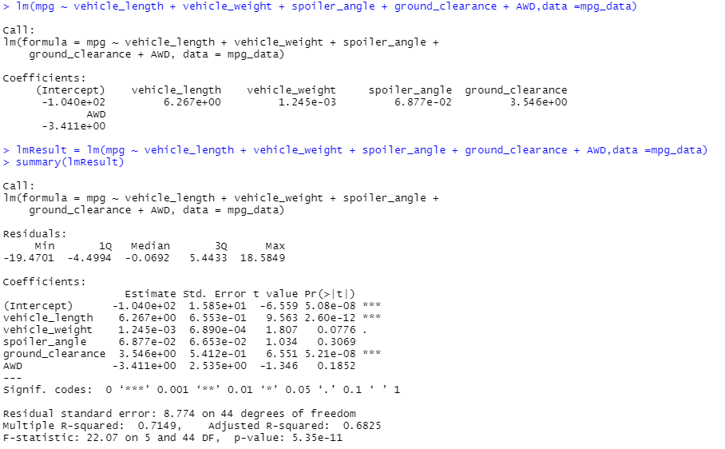
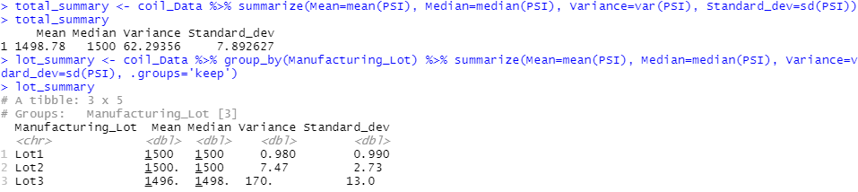
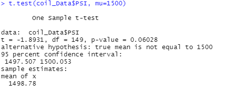
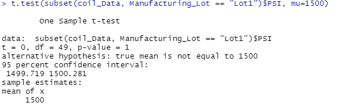
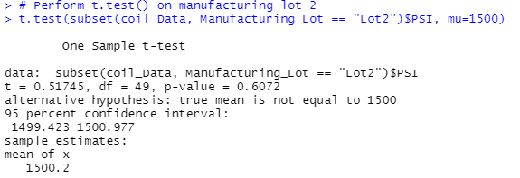
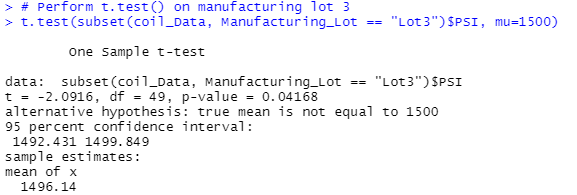

# MechaCar_Statistical_Analysis

## Linear Regression to Predict MPG

 - Which variables/coefficients provided a non-random amount of variance to the mpg values in the dataset? vehicle weight, spoiler_angle, AWD
 - Is the slope of the linear model considered to be zero? Why or why not? No, it is not (p-value: 5.35e-11)
 - Does this linear model predict mpg of MechaCar prototypes effectively? Why or why not? Because R-squared = 0.7149, roughtly 71.49% of future data can be correctly predicted.

## Summary Statistics on Suspension Coils

 - The design specifications for the MechaCar suspension coils dictate that the variance of the suspension coils must not exceed 100 pounds per square inch. Does the current manufacturing data meet this design specification for all manufacturing lots in total and each lot individually? Why or why not? While variances and standard deviations of lot 1 and lot 2 are in an acceptable range, lot 3 has variance of 170 and standard deviation of 13. This is not usual and should be assessed in depth. 

## T-Tests on Suspension Coils
T-Test on all manufacturing lots

With t = -1.8931, the manufacturing result across manufacturing lots is statistically different from the desired population mean of 1500 PSI. p_value is low (0.06028) means that this result doesn not happen by chance.

T-Test on lot 1

T-Test on lot 2

T-Test on lot 3

In the three lots, lot 1 and 2 have low t-value which means the production results are close to 1500 PSI. However, lot 3's t-value = -2.0916 which indicates a statistically difference with the population mean of 1500 PSI. Moreover, low p-value (0.04168) means this does not happen by chance. 

## Study Design: MechaCar vs Competition
To consider competitive factors from customer's perspectives, the company should various factors such as price, fuel efficiency, horse power, owning expenses, safety rating, life expectancy, engine type, functions, etc. Data can be collected from MechaCar factory and competiiors. After collecting data, the company should use ANOVA test to assess the difference between cars produced by the company and competitors. The two criterias to be focused on are t-value which is the difference between two groups (the higher the more different) and p-value (the lower the more consistent). 

